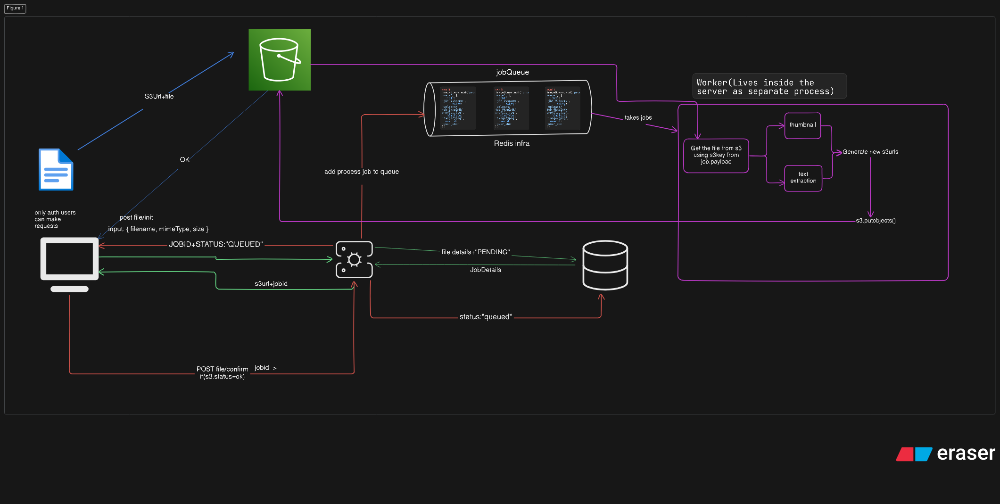

<p align="center">
  
</p>

<h1 align="center">RelayPipe</h1>

<p align="center">
  <b>A file-processing pipeline platform</b> — sign in, upload a file, and watch it move through a real pipeline:
  <i>queued → processed → delivered</i>, step by step, live on screen.
</p>

<p align="center">
  <a href="#getting-started"></a>
  <a href="#getting-started"></a>
  <a href="#tech-stack"></a>
  <a href="#tech-stack"></a>
  <a href="#tech-stack"></a>
</p>

<p align="center">
  <a href="#tech-stack"></a>
  <a href="#tech-stack"></a>
  <a href="#tech-stack"></a>
  <a href="#tech-stack"></a>
  <a href="#tech-stack"></a>
</p>

<p align="center">
  <a href="#monorepo-layout"></a>
  <a href="#monorepo-layout"></a>
  <a href="#tech-stack"></a>
  <a href="#api"></a>
  <a href="#api"></a>
</p>

---

## Table of contents

- [Features](#features)
- [Architecture](#architecture)
- [How it works](#how-it-works)
- [Monorepo layout](#monorepo-layout)
- [Tech stack](#tech-stack)
- [Data model](#data-model)
- [Getting started](#getting-started)
- [Scripts](#scripts)
- [API](#api)
- [Roadmap](#roadmap)

---

## Features

- 🔐 **Authentication & per-user scoping** — Sign in with Clerk; every job belongs to your account.
- 📤 **End-to-end upload path** — The API validates metadata and hands back a **presigned S3 PUT URL**, so files stream directly to S3 — never through the server.
- 📋 **Live job tracking** — Every upload becomes a `Job` that moves through `pending → queued → processing → done | failed`.
- 🖼️ **Polished upload UX** — Custom `useFileUpload` hook with progress bar, drag & drop, and retry.
- 📜 **Contract-first API** — Routes and Zod schemas defined once in `@repo/contract`; an OpenAPI spec is generated automatically and served at `/api`.
- ⚙️ **Background processing** — BullMQ worker + Redis picks up jobs and processes them out of the request path.
- 🔔 **Webhook delivery** *(planned)* — Per-user endpoints with delivery attempts and status tracking.

---

## Architecture



The upload path is fully wired end-to-end today: the web app creates a job record, hands the client a presigned S3 PUT URL, the client uploads directly to S3, then confirms the job through the API. The processing layer (background worker, outputs, webhooks) is scaffolded in the database schema and partially implemented.

---

## How it works

1. **Sign in** — Authenticate with Clerk. Only authenticated users can make requests.
2. **Initialize** — The client calls `POST /api/v1/fileinit` with `{ filename, mimeType, size }`. The API validates (MIME type, ≤ 50 MB), creates a `pending` job in PostgreSQL, and returns `{ s3url, jobId }`.
3. **Upload** — The client PUTs the file straight to S3 using the presigned URL, then confirms with `POST /api/v1/fileconfirm`.
4. **Queue** — The job is enqueued on a BullMQ queue (`image-worker` / `pdf-worker`) backed by Redis. *(DB persistence + queue wiring in progress)*
5. **Process** — The worker fetches the file from S3 using the job's `s3Key` and produces outputs (thumbnails, text extraction…). *(worker currently a stub)*
6. **Deliver** — Outputs are written back to S3 under new keys, and webhooks are delivered. *(roadmap)*

---

## Monorepo layout

This is a [Turborepo](https://turborepo.dev) monorepo managed with [pnpm](https://pnpm.io) workspaces.

### Apps

| App | Path | Description |
| --- | --- | --- |
| `file-api` | `apps/FileAPI` | Main Next.js app (port `3000`). Landing page, `/project` upload dashboard, and the API itself — served from `/api` via oRPC's OpenAPI handler, which also generates the OpenAPI spec. |
| `file_worker` | `apps/file_worker` | BullMQ background worker (TypeScript, run with `tsx`). Connects to Redis, consumes jobs from the shared queues, and runs image/PDF processors. |
| `docs` | `apps/docs` | Next.js app on port `3001` — leftover Turborepo starter scaffold. |

### Packages

| Package | Path | Description |
| --- | --- | --- |
| `@repo/contract` | `packages/contract` | [oRPC](https://orpc.unnoq.com) contract — the single source of truth for the API. Defines routes (`fileinit`, `fileupload`, `get_api`), Zod input/output schemas, and the shared error registry (`BAD_REQUEST`, `UNAUTHORIZED`, `NOT_FOUND`, …). |
| `@repo/database` | `packages/database` | Prisma 7 setup with the `pg` adapter. Schema (`prisma/schema.prisma`), migrations, and a shared `prisma` client instance. |
| `@repo/queue` | `packages/queue` | Shared queue layer — BullMQ `imageQueue` / `pdfQueue` instances plus the ioredis connection used by both the web app and the worker. |
| `@repo/ui` | `packages/ui` | Small React component library (`button`, `card`, `code`). |
| `@repo/eslint-config` | `packages/eslint-config` | Shared ESLint configs (`base`, `next-js`, `react-internal`). |
| `@repo/typescript-config` | `packages/typescript-config` | Shared `tsconfig` presets. |

---

## Tech stack

| Layer | Technology |
| --- | --- |
| **Monorepo** | Turborepo + pnpm workspaces |
| **Web** | Next.js 16 · React 19 · Tailwind CSS v4 · shadcn-style components |
| **API** | oRPC (contract-first) — served as an OpenAPI handler with a generated OpenAPI spec |
| **Auth** | Clerk (middleware + `currentUser()`) |
| **Database** | PostgreSQL + Prisma 7 (`@prisma/adapter-pg`) |
| **Object storage** | AWS S3 with presigned URLs (`@aws-sdk/client-s3`) |
| **Queues** | BullMQ + Redis (worker app); Upstash Redis in the web app |
| **Upload UI** | Custom `useFileUpload` hook + upload component with progress, drag-and-drop, and retry |

---

## Data model

Defined in `packages/database/prisma/schema.prisma` (PostgreSQL):

- **User** — identified by email (from Clerk). `users` table.
- **Job** — one upload: `s3Key`, `filename`, `mimeType`, `size`, `jobType` (`image` | `pdf`), `status` (`pending` → `queued` → `processing` → `done` | `failed`), retry/error fields, timestamps.
- **JobOutput** — artifacts produced by processing a job (`outputType`, `s3Key`, `url`).
- **WebhookEndpoint / WebhookDelivery** — per-user webhook endpoints and their delivery attempts (`pending` | `delivered` | `failed`).

---

## Getting started

### Prerequisites

- Node.js ≥ 18 and pnpm 9
- A PostgreSQL database (for `DATABASE_URL`)
- An AWS S3 bucket + access keys (for presigned uploads)
- A Clerk application (for auth)
- Redis — local for the worker, Upstash for the web app

### Install & configure

```sh
pnpm install
```

Create `.env` files. The build expects env vars in `apps/FileAPI/.env` (and `packages/database/.env` for the Prisma CLI):

| Variable | Purpose |
| --- | --- |
| `DATABASE_URL` | Postgres connection string |
| `NEXT_PUBLIC_CLERK_PUBLISHABLE_KEY` / `CLERK_SECRET_KEY` | Clerk auth |
| `BUCKET_NAME` / `BUCKET_REGION` / `S3_ACCESS_KEY` / `S3_SECRET_ACCESS_KEY` | S3 presigned uploads |
| `UPSTASH_REDIS_REST_URL` / `UPSTASH_REDIS_REST_TOKEN` | Upstash Redis (web app) |
| `UPSTASH_REDIS_URL` | Upstash Redis connection string for the BullMQ worker (`apps/file_worker/.env`) |
| `BETTER_AUTH_SECRET` / `AUTH_GOOGLE_ID` / `AUTH_GOOGLE_SECRET` | Reserved (better-auth dependency) |

### Set up the database

```sh
pnpm db:generate   # generate the Prisma client
pnpm db:migrate    # apply migrations
pnpm db:studio     # browse the DB in Prisma Studio
```

### Run it

```sh
pnpm dev                      # all apps (FileAPI on :3000, docs on :3001)
pnpm dev --filter=file-api    # web app + API only
pnpm dev --filter=file_worker # background worker
```

Open [http://localhost:3000](http://localhost:3000) (sign in with Clerk), then upload a file on the landing page or `/project`. The OpenAPI spec is served at [http://localhost:3000/api](http://localhost:3000/api).

---

## Scripts

Run from the repo root:

| Command | Description |
| --- | --- |
| `pnpm dev` | Run all apps in dev mode |
| `pnpm build` | Build all apps and packages |
| `pnpm lint` | Lint everything |
| `pnpm check-types` | Typecheck everything |
| `pnpm format` | Format with Prettier |
| `pnpm db:generate` | Regenerate the Prisma client |
| `pnpm db:migrate` / `pnpm db:migrate:prod` | Apply DB migrations |
| `pnpm db:studio` | Open Prisma Studio |

---

## API

The API is defined contract-first in `packages/contract` and served by `apps/FileAPI` under the `/api` prefix. All routes are JSON.

| Method | Path | Description |
| --- | --- | --- |
| `POST` | `/api/v1/fileinit` | Validates file metadata (MIME type, ≤ 50 MB), creates a pending `Job`, returns `{ s3url, jobId }` |
| `POST` | `/api/v1/fileconfirm` | Confirms a job after a successful S3 upload, returns `{ jobId, Status }` (DB/queue wiring pending) |

**Supported MIME types:** `image/jpeg`, `image/png`, `image/webp`, `application/pdf`.

---
